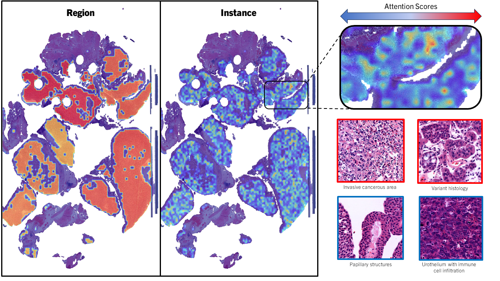

Certainly! Here's the updated GitHub README for the HistoPrognostics project, with the license section removed as per your request:

---

# HistoPrognostics

This repository provides the implementation of the framework presented in the paper:

**"Self-Contrastive Weakly Supervised Learning Framework for Prognostic Prediction Using Whole Slide Images"**
*Authors: Saul Fuster, Farbod Khoraminia, Julio Silva-Rodríguez, Umay Kiraz, Geert J. L. H. van Leenders, Trygve Eftestøl, Valery Naranjo, Emiel A.M. Janssen, Tahlita C.M. Zuiverloon, and Kjersti Engan*
*Status: Under revision*

## Overview

HistoPrognostics is a deep learning framework designed to analyze histopathological whole slide images (WSIs) for prognostic prediction. The framework addresses the challenge of weakly labeled data by integrating three key components:

1. **Tissue Segmentation**: A convolutional neural network (CNN) based algorithm to delineate regions of interest (ROIs) within WSIs.
2. **Contrastive Learning Module**: Extracts robust feature embeddings from the segmented ROIs using self-contrastive learning techniques.
3. **Nested Multiple Instance Learning (MIL) Classifier**: Aggregates features from multiple ROIs to make slide-level prognostic predictions.

The framework has been validated on both synthetic datasets and real-world bladder cancer WSIs, achieving Area Under the Curve (AUC) scores of 0.721 for recurrence prediction and 0.678 for treatment outcome prediction.

## Getting Started

### Prerequisites

Ensure you have the necessary dependencies installed. Refer to the `requirements.txt` file for a comprehensive list.

### Modules

#### Contrastive Learning

* **Scripts**: `main__monoscale.py` (single magnification), `main__multiscale.py` (multi-scale magnification)
* **Functionality**:

  * Train CNN backbones to generate feature embeddings by maximizing similarity between positive pairs and minimizing it between negative pairs.
  * Configure network architecture, loss functions, and training hyperparameters within the scripts.
  * Save and load pre-trained models for feature extraction.

#### Classification

* **Script**: `main__nmil.py`
* **Functionality**:

  * Builds a nested MIL classification model using extracted features, clinicopathological data, or a combination of both.
  * Hierarchically combines information from image regions to make final predictions.
  * Offers configuration options for classifier architecture, data modalities, and MIL pooling techniques.

#### Inference and Evaluation

* **Inference**: Use `inference.py` to perform predictions on new WSIs using the trained classification model.
* **Evaluation**: `logistic_regression.py` provides performance metrics and insights into the trained model's efficacy.

## Usage

1. **Train Contrastive Model**:
   Run `main__monoscale.py` or `main_multiscale.py` to train the contrastive learning module on your dataset. Adjust data loaders and training settings as needed.

2. **Extract Features**:
   Use the trained model to generate feature embeddings for your dataset.

3. **Train Classifier**:
   Run `main__nmil.py` to train the nested MIL classifier using the extracted features and/or clinicopathological data.

4. **Inference**:
   Use `inference.py` to make predictions on new WSIs.

5. **Evaluate Performance**:
   Run `logistic__regression.py` to assess the model's performance using various metrics.

## Citation

If you utilize this framework in your research, please cite our work:

*Citation details will be provided upon publication.*

